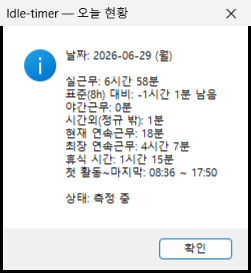
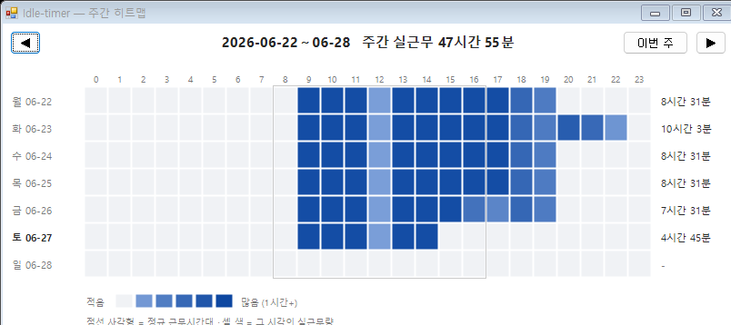
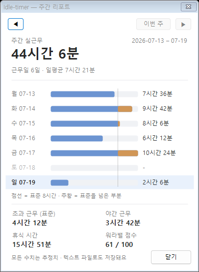
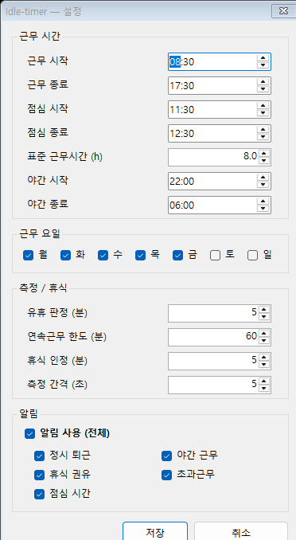

# Idle-timer — 워라밸 모니터링 트레이 앱

> **오늘 나는 얼마나 일했을까?**
> 키보드·마우스 활동만으로 실근무·초과·야간·휴식을 자동으로 기록해, 내 워라밸을 조용히 지켜봐 주는 Windows 트레이 앱입니다.

설치도, 로그인도, 클라우드도 없습니다. 받아서 **더블클릭하면 끝** — 트레이에 작은 시계 아이콘으로 상주합니다.

**이런 분께 좋아요**
- 🌙 야근·초과가 얼마나 쌓이는지 객관적인 숫자로 확인하고 싶은 분
- ⏱️ 점심·자리비움을 뺀 "진짜 일한 시간"이 궁금한 분
- 🔒 외부 전송 없이 내 PC에서만 조용히 기록하고 싶은 분

**특징**
- **가볍게 상주** — 트레이에 작게 떠서 PC 자원을 거의 쓰지 않아요.
- **로컬 전용** — 측정 기록은 모두 내 PC에만 저장됩니다. (예외: **업데이트 확인**을 누를 때만 GitHub에서 최신 버전 번호를 조회하며, 이때도 내 데이터는 보내지 않아요.)
- **자기관찰용** — 본인 근무 패턴을 스스로 확인하는 도구예요. 타인 감시·근태 강제용이 아닙니다.

## 목차

- 📸 [스크린샷](#스크린샷)
- ⬇️ [다운로드](#다운로드) · 🚀 [처음 시작하기](#처음-시작하기) · 🖱️ [매일 이렇게 쓰세요](#매일-이렇게-쓰세요)
- 📊 [측정 지표](#측정-지표) · 🗓️ [주간 히트맵](#주간-히트맵) · 🔔 [알림](#알림) · ⚙️ [설정](#설정)
- 📁 [내 데이터 위치](#내-데이터-위치) · ❓ [자주 묻는 질문](#자주-묻는-질문)
- 🧪 [위장 모드 (테스트 기능)](#테스트-기능--위장-모드-실험) · ⚖️ [면책 조항](#면책-조항)

## 스크린샷

**오늘 현황** — 트레이 아이콘을 더블클릭하면 지금까지의 실근무·휴식·연속근무를 한눈에

**주간 히트맵** — 요일 × 시각별 실근무량으로 야근·휴식 패턴이 한눈에

**주간 리포트** — 한 주 요약과 **워라밸 점수**로 내 한 주를 돌아보기

**설정** — 근무시간·점심·근무 요일·야간·알림을 한 곳에서

---

## 다운로드

[**Releases**](https://github.com/ff-1204/idle-timer/releases/latest) 에서 `IdleTimer.exe` 를 내려받으세요. 설치 없이 단일 실행파일로 동작합니다 (Windows 10/11, .NET Framework 4.x 기본 포함).

## 처음 시작하기

1. 내려받은 `IdleTimer.exe` 를 **더블클릭**합니다. (설치 과정 없음)
2. **면책 조항**을 읽고 동의에 체크 → **동의하고 시작**. (동의해야 실행됩니다)
3. **근무시간 설정** 창에서 근무 시작/종료·점심시간·근무 요일·야간 시간대를 정합니다.
   - 잘 모르겠으면 **"기본값으로 시작"** 을 누르세요. 기본값(근무 08:30–17:30, 점심 11:30–12:30, 월~금)이 적용되고 나중에 언제든 바꿀 수 있습니다.
4. 끝나면 트레이(화면 우측 하단)에 **파란 시계 아이콘**이 생깁니다. 이제부터 자동으로 측정합니다.

> 별도 창이 계속 떠 있지 않아도 정상입니다(트레이 상주형). 아이콘이 안 보이면 트레이의 `^`(숨은 아이콘 표시)를 눌러 보세요. 항상 보이게 하려면 그 아이콘을 트레이 막대로 끌어다 두면 됩니다. 중복 실행은 자동으로 막힙니다.

## 매일 이렇게 쓰세요

- 아이콘 **더블클릭** → 지금까지의 **오늘 현황**(실근무·휴식·연속근무·첫·마지막 활동 등)을 바로 확인
- 잠깐 자리를 길게 비우거나 사적인 일을 할 땐 **우클릭 → 일시정지**(아이콘이 회색), 돌아오면 **재개**
- 한 주를 돌아볼 땐 **우클릭 → 주간 리포트**(요약·워라밸 점수) 또는 **주간 히트맵**(언제 많이 일했는지)

### 트레이 우클릭 메뉴 한눈에

| 메뉴 | 하는 일 |
|---|---|
| **오늘 현황** | 오늘의 실근무·휴식·연속근무·첫/마지막 활동 요약 (더블클릭과 동일) |
| **주간 리포트** | 이번 주 요일별 집계 + 합계 + 워라밸 점수. 텍스트 파일로도 저장 |
| **주간 히트맵** | 요일 × 시각 격자로 근무 분포를 시각화 |
| **일시정지 / 재개** | 측정을 잠시 멈춤·재개 (멈춘 시간은 휴식으로 잡히지 않음) |
| **시작 시 자동 실행** | Windows 로그인 시 자동 실행 켜기/끄기 |
| **위장 모드 (테스트 기능)** | 실험용 기능 — 아래 [위장 모드](#테스트-기능--위장-모드-실험) 참고 |
| **설정…** | 근무시간·점심·요일·야간·알림 등 모든 설정 변경 |
| **데이터 폴더 열기 / 설정 파일 열기** | 내 기록(CSV·로그)·`config.ini` 위치 바로 열기 |
| **업데이트 확인** | GitHub에서 최신 버전을 확인해 새 버전이 있으면 다운로드 페이지로 안내 (수동) |
| **도움말** | 안내 및 면책 조항 보기 |
| **종료** | 앱 종료 (다음에 다시 더블클릭하면 이어서 기록) |

---

## 측정 지표

| 지표 | 설명 |
|---|---|
| **실근무** | 자리비움(입력 없음)과 점심시간을 뺀 실제 활동 시간 |
| **점심시간** | 설정한 점심 시간대는 활동이 있어도 실근무에서 제외(휴식으로 간주) |
| **초과근무** | 실근무가 표준 근무시간을 넘은 시간 |
| **시간외 근무** | 정규 근무시간대 밖에서 일한 시간 |
| **야간근무** | 설정한 야간 시간대의 근무 |
| **연속근무** | 휴식 없이 이어서 일한 시간. 일정 시간(기본 5분) 이상 자리를 비우면 끊겨 다시 셉니다 |
| **휴식 시간** | 근무 중 자리를 비운 시간의 합(분 단위). 점심·일시정지는 제외하며, 그날 첫 활동~마지막 활동 사이를 기준으로 잡습니다 |
| **첫 활동 ~ 마지막** | 그날의 첫·마지막 활동 시각 |
| **워라밸 점수** | 초과·야간·장시간 근무가 많을수록 낮아지는 점수(주간 리포트) |

## 주간 히트맵

**우클릭 → 주간 히트맵** 으로 요일(월~일) × 시각(0~23시) 격자를 볼 수 있습니다.
- 셀 색이 진할수록 그 시각에 일을 많이 한 것
- 점선 사각형 = 정규 근무시간대
- 우상단 **◀ / 이번 주 / ▶** 로 주 단위 이동, 요일별·주간 합계 표시

야근이 몰리는 시간대, 점심·휴식 패턴, 정규시간 밖 근무를 한눈에 볼 수 있습니다.

## 알림

업무 흐름에 맞춰 트레이 풍선으로 살짝 알려줍니다.

- **점심 시간**: 점심 시작 시 (하루 1회)
- **정시 퇴근**: 퇴근 시간 이후 첫 활동 시 (하루 1회, 주말 등 비근무일엔 울리지 않음)
- **휴식 권유**: 오래 연속으로 일했을 때 — 이후 **1시간마다** 다시 알림 (휴식하면 초기화)
- **야간 근무**: 야간 시간대에 일할 때 — 이후 **1시간마다** 다시 알림
- **초과근무**: 실근무가 표준 근무시간을 넘는 순간 — 이후 **1시간마다** 다시 알림

- 🌙 **수면시간**(기본 00:00~07:00)에는 **모든 알림을 끕니다**. 설정 창에서 시간을 바꾸거나 끌 수 있어요.
- 각 알림은 설정 창에서 개별로 켜고 끌 수 있고, **알림 사용 (전체)** 토글로 한 번에 끌 수 있습니다.

---

## 설정

트레이 우클릭 → **설정…** 에서 근무시간·점심시간·근무 요일·야간 시간대·알림·**수면시간**·**Windows 시작 시 자동 실행** 등을 바꿀 수 있습니다. 저장하면 바로 적용됩니다.

> **Windows 시작 시 자동 실행**: 켜면 로그인할 때 자동으로 실행됩니다(현재 사용자 기준). 설정 창의 "기타" 항목 또는 트레이 메뉴의 **시작 시 자동 실행** 에서 켜고 끌 수 있습니다.

## 내 데이터 위치

모든 기록은 `%APPDATA%\IdleTimer\` 폴더에 저장됩니다 (트레이 메뉴 **데이터 폴더 열기**).

| 파일 | 내용 |
|---|---|
| `daily.csv` | 하루 1줄 집계 (엑셀로 열어 분석 가능) |
| `hourly.csv` | 시각별 실근무 (주간 히트맵 데이터) |
| `weekly_*.txt` | 주간 리포트 |
| `summary.log` | 알림·일일 마감 기록 |

## 자주 묻는 질문

**자리비움 판정이 너무 예민/둔해요.**
설정 → **유휴 판정 (분)** 을 조절하세요. 이 시간 이상 입력이 없으면 자리비움으로 봅니다(기본 5분).

**측정을 잠깐 멈추고 싶어요.**
트레이 우클릭 → **일시정지**. 회의·식사 등으로 자리를 비울 때 쓰면 그 시간이 휴식·근무에 섞이지 않습니다. 돌아오면 **재개**.

**처음 설정 화면(면책 동의·근무시간)을 다시 보고 싶어요.**
데이터 폴더(**데이터 폴더 열기**)의 `consent.txt` 를 지우고 다시 실행하면 첫 실행 흐름이 다시 나타납니다. 기본값부터 새로 적용하려면 `config.ini` 도 함께 지우세요.

**다른 PC로 기록을 옮기고 싶어요.**
`%APPDATA%\IdleTimer\` 폴더를 통째로 복사해 같은 위치에 붙여넣으면 됩니다.

**알림이 너무 자주/안 떠요.**
설정 → **알림** 에서 항목별로 켜고 끄거나, **알림 사용 (전체)** 로 모두 끌 수 있습니다. 야간·초과·휴식 권유는 1시간마다 반복되니, 잦다고 느끼면 해당 항목을 끄세요.

**밤에는 알림을 받고 싶지 않아요.**
설정 → **알림** → **수면시간**(기본 00:00~07:00)을 켜 두면 그 시간엔 모든 알림이 꺼집니다. 자정을 넘기는 시간대(예: 23:00~07:00)도 됩니다.

**새 버전이 나왔는지 어떻게 알아요?**
트레이 우클릭 → **업데이트 확인**. GitHub의 최신 버전 번호만 받아 와 현재 버전과 비교하고, 새 버전이 있으면 다운로드 페이지로 안내합니다. 직접 누를 때만 동작하며(자동 확인 없음), 인터넷이 없으면 안내 메시지만 뜨고 평소처럼 계속 동작합니다.

---

## 테스트 기능 — 위장 모드 (실험)

> ⚠️ **이것은 정식 측정 기능이 아니라, 이 서비스의 테스트(실험) 기능입니다.**

**위장 모드**는 활동을 자동으로 만들어 내 "유휴 시간"을 0으로 유지하는 실험 기능입니다. 이 앱이 사용하는 **활동 추정 방식의 한계를 직접 점검**하기 위한 용도예요. 트레이 우클릭 → **위장 모드 (테스트 기능)** 으로 켜고 끄며, **켜거나 끌 때마다 확인 팝업**이 뜹니다(켤 때는 책임 고지에 동의해야 작동).

- 켜는 동안 마우스가 사람처럼 불규칙한 간격(대개 수 초, 가끔 30초까지)으로 무작위 지점을 향해 곡선을 그리며 잠깐씩 움직입니다.
- **이 앱의 실근무·휴식 측정값도 함께 오염됩니다**(자기 자신도 속습니다). 그래서 정상적인 워라밸 측정과 동시에 쓰는 기능이 아닙니다.
- **일시정지** 중에는 위장 이동도 멈춥니다.
- **본인 소유 PC에서만** 사용하세요. 타인의 감시 시스템을 기만하는 등 부적절하게 사용해 발생하는 **모든 책임은 전적으로 사용자 본인에게** 있습니다.

기본값은 꺼짐이며, 트레이 아이콘 툴팁에 `[위장]` 으로 켜진 상태가 표시됩니다.

---

## 면책 조항

본 소프트웨어는 **"있는 그대로(AS IS)"** 제공되며 어떠한 보증도 하지 않습니다.
**이 프로그램의 사용으로 인한 모든 책임은 전적으로 사용자 본인에게 있으며, 제작자(ff-1204)는 데이터 손실·측정 오차·근태/인사상 불이익·규정 위반·법적 분쟁 등 어떠한 직간접적 손해에 대해서도 책임지지 않습니다.**

- 모든 측정값은 추정치이며, 공식 근태·평가·증빙 자료로 사용해서는 안 됩니다.
- 사용자는 소속 조직의 정책 및 관련 법규를 준수할 책임이 있습니다.
- 이 프로그램을 사용함으로써 위 내용에 동의한 것으로 간주합니다.

전문은 [DISCLAIMER.md](DISCLAIMER.md) 참고. 문의: **dorimhan@kakao.com**
(앱에서는 트레이 메뉴 **도움말** 에서 같은 내용을 볼 수 있습니다.)

---

## 문서

- [CHANGELOG.md](CHANGELOG.md) — 버전별 변경 이력
- [DISCLAIMER.md](DISCLAIMER.md) — 면책 조항 전문
- [DEVELOPMENT.md](DEVELOPMENT.md) — 빌드·개발 가이드

## 라이선스

[MIT License](LICENSE) © 2026 ff-1204
